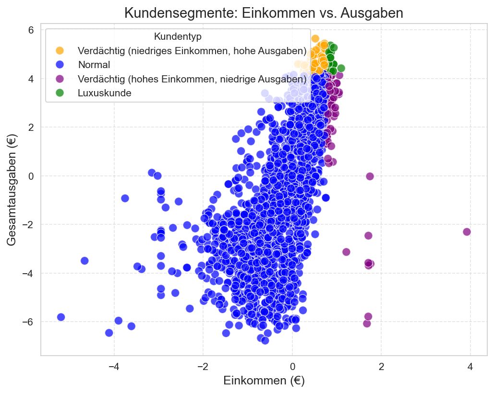
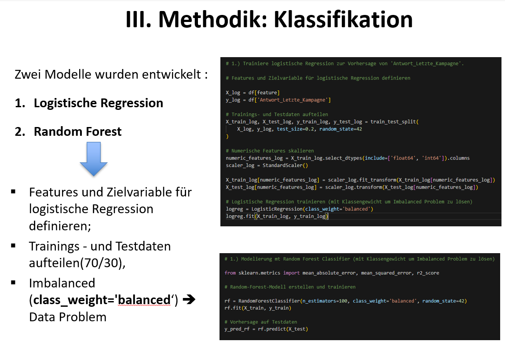
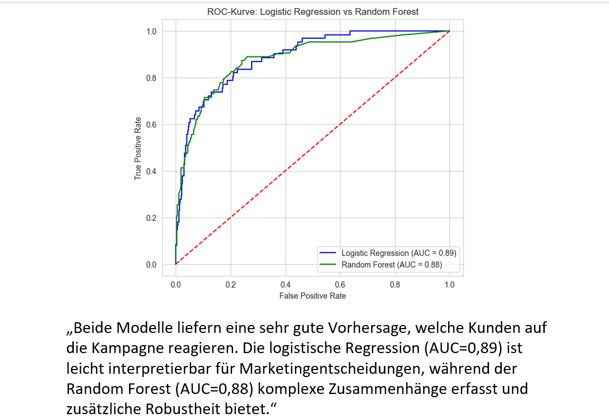

# 📊 Customer Analytics & Classification Project

## 🚀 Projektübersicht
Dieses Projekt analysiert Kundenverhalten anhand von Einkommen und Ausgaben und entwickelt Machine-Learning-Modelle zur Vorhersage von Marketingreaktionen.

Ziel ist es, datenbasierte Entscheidungen im Marketing zu ermöglichen und Kundensegmente besser zu verstehen.

---

## 📌 Projektziele
- Analyse von Kundenverhalten (Einkommen vs. Ausgaben)
- Identifikation von Kundensegmenten
- Vorhersage der Reaktion auf Marketingkampagnen
- Vergleich von Machine-Learning-Modellen

---

## 📊 Kundensegmente

Die Visualisierung zeigt verschiedene Kundensegmente:

- 🔵 **Normale Kunden** – durchschnittliches Verhalten  
- 🟢 **Luxuskunden** – hohes Einkommen & hohe Ausgaben  
- 🟡 **Verdächtige Kunden** – niedriges Einkommen, hohe Ausgaben  
- 🟣 **Auffällige Kunden** – hohes Einkommen, geringe Ausgaben  

👉 Diese Segmentierung dient als Grundlage für gezielte Marketingstrategien.

---

## 🧠 Methodik

Zwei Modelle wurden entwickelt:

### 1. Logistic Regression
- Einfach interpretierbar  
- Gut geeignet für Business-Entscheidungen  

### 2. Random Forest
- Erkennt komplexe Zusammenhänge  
- Höhere Robustheit  

### ⚙️ Vorgehen:
- Feature Engineering  
- Train-Test-Split (70/30)  
- Skalierung der Daten  
- Umgang mit imbalancierten Daten (`class_weight='balanced'`)  

---

## 📈 Modellbewertung

### Ergebnisse:
- **Logistic Regression:** AUC = **0.89**  
- **Random Forest:** AUC = **0.88**  

👉 Beide Modelle liefern sehr gute Vorhersagen.

---

## 💡 Key Insights
- Kunden lassen sich klar segmentieren  
- Machine Learning verbessert Marketingentscheidungen  
- Logistic Regression ist leicht interpretierbar  
- Random Forest erkennt komplexe Muster  

---

## 🛠️ Technologien
- Python (Pandas, NumPy, Scikit-learn)
- Matplotlib & Seaborn
- Machine Learning (Logistic Regression, Random Forest)
- Jupyter Notebook

---

## 📂 Projektstruktur

---

## 📌 Fazit
Dieses Projekt zeigt, wie datengetriebene Methoden genutzt werden können, um:
- Kunden besser zu verstehen  
- Marketingstrategien zu optimieren  
- fundierte Entscheidungen zu treffen  

---

## 👨‍💻 Autor
**Boris Yannick Nobom Petamba**  
Data Analyst | SQL | Python | Power BI | KNIME  

---
